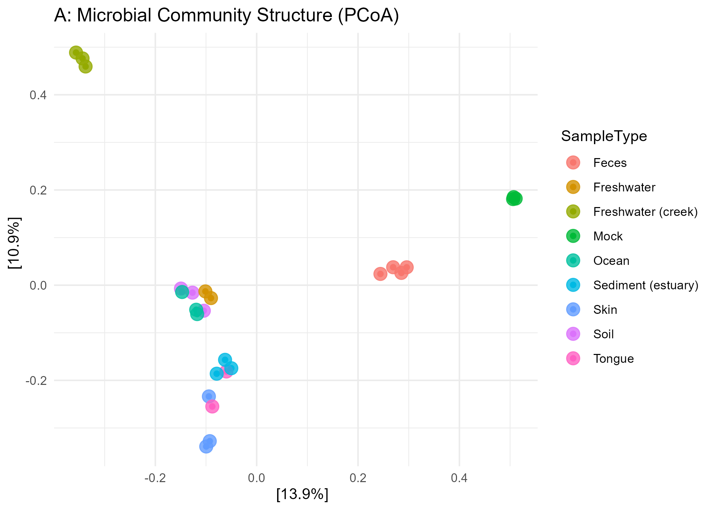
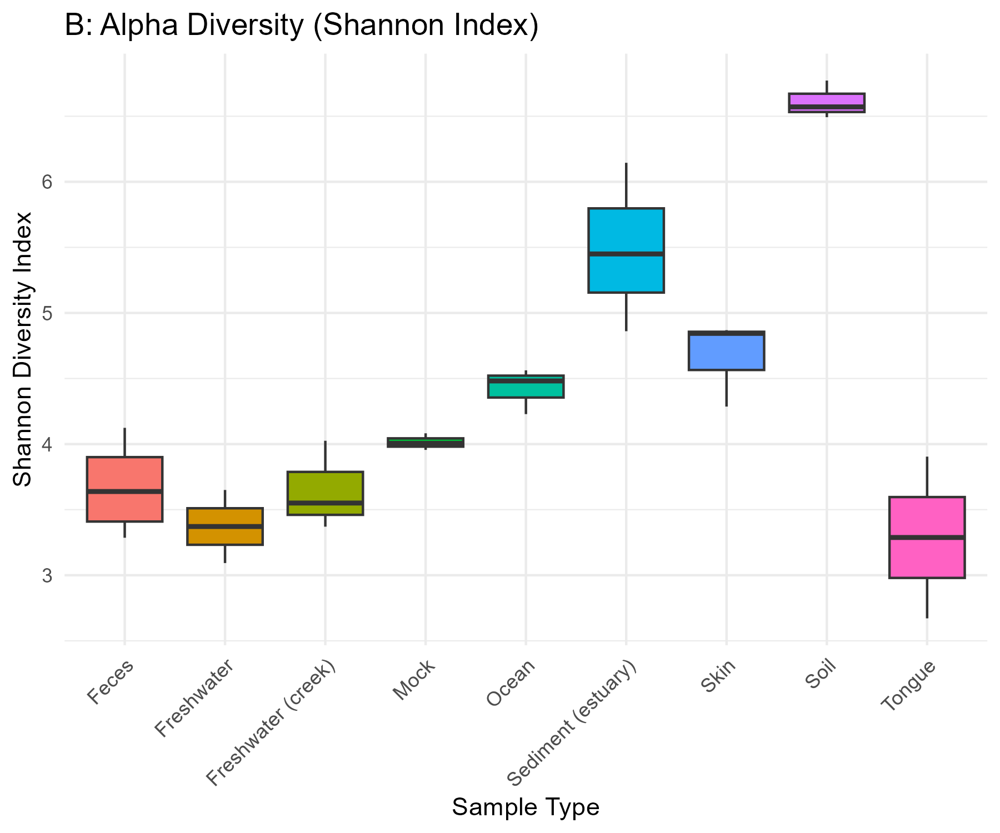
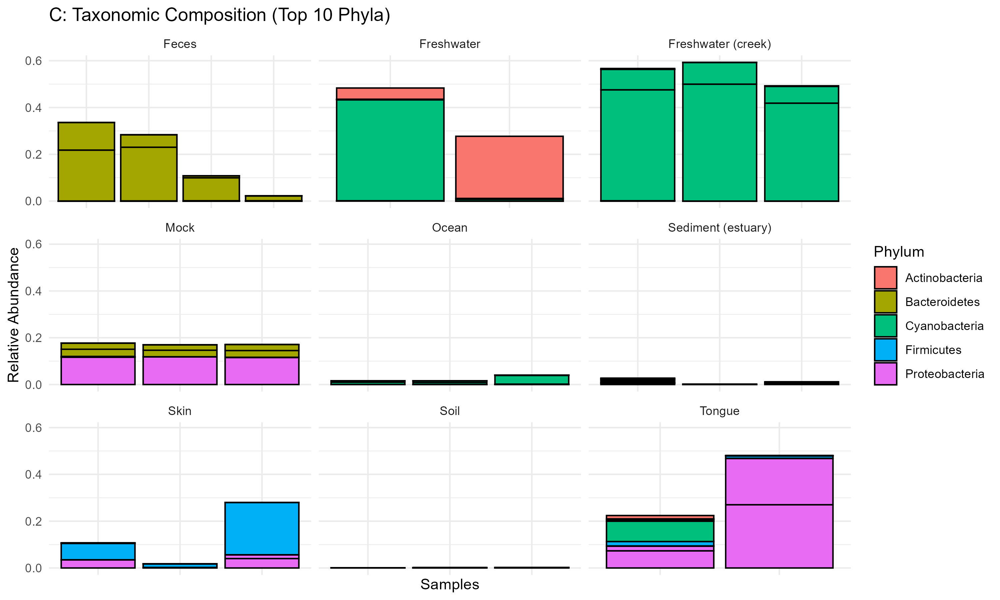
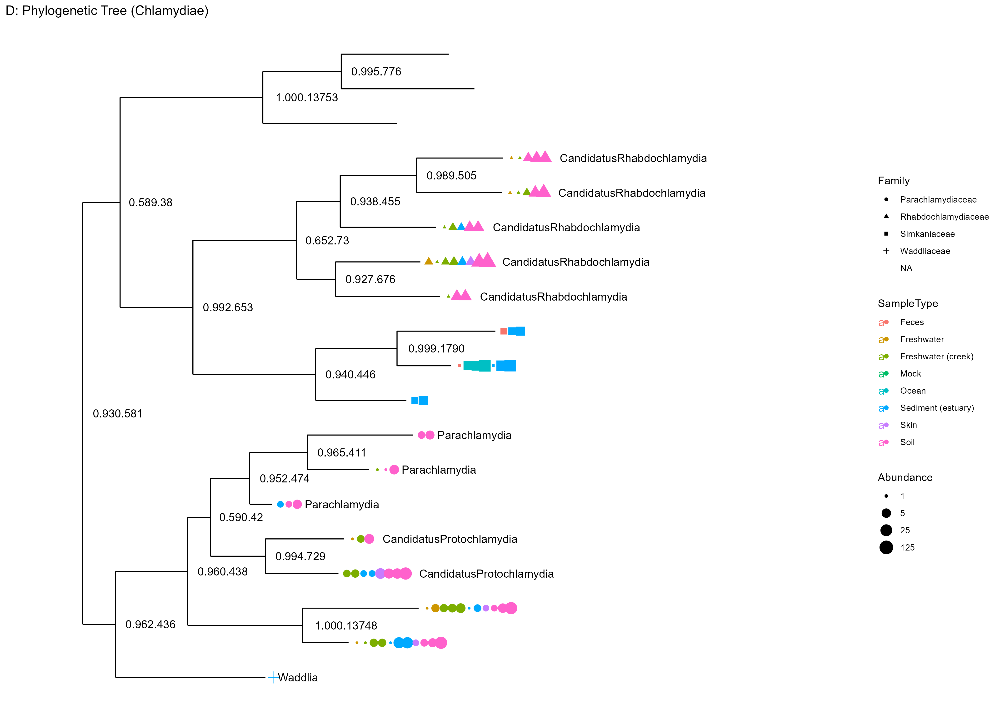

# Microbiome Data Analysis (GlobalPatterns)

This project explores microbial community structure across different environments using microbiome data analysis in R.

---

## Dataset

The analysis uses the **GlobalPatterns** dataset from the phyloseq package, which contains microbiome samples from diverse environments such as:

- Soil  
- Ocean  
- Skin  
- Feces  
- Freshwater  

---

## Analysis Performed

### 1. Community Structure (PCoA)
- Method: Bray-Curtis distance
- Purpose: Compare microbial composition across environments

### 2. Alpha Diversity (Shannon Index)
- Measures within-sample diversity
- Compares diversity across sample types

### 3. Taxonomic Composition
- Relative abundance at phylum level
- Identifies dominant microbial groups

### 4. Phylogenetic Analysis (Chlamydiae)
- Subset of taxa belonging to Chlamydiae
- Visualizes evolutionary relationships using a phylogenetic tree

---

## Results

### A: Community Structure (PCoA)


### B: Alpha Diversity


### C: Taxonomic Composition


### D: Phylogenetic Tree (Chlamydiae)


---

## Full Analysis Report

You can view the complete analysis (including code and outputs) here:

[Open HTML Report](https://nkiruka-cynthia.github.io/microbiome-learning-journey/scripts/01_exploration.html)

---

## Tools & Packages

- R  
- phyloseq  
- ggplot2  
- vegan  
- ggtree  

---

## Project Structure

```
Microbiome-Data-Visualization/
│── README.md
│── scripts/
│    ├── 01_exploration.Rmd
│    ├── 01_exploration.html
│── results/
│    ├── A_pcoa.png
│    ├── B_diversity.png
│    ├── C_taxa_barplot.png
│    ├── D_phylogenetic_tree_chlamydiae.png
```

---

## Key Insights

- Microbial communities differ significantly across environments  
- Diversity varies between sample types, indicating ecological differences  
- Certain environments are dominated by specific microbial taxa  
- Phylogenetic analysis reveals evolutionary relationships within selected taxa (Chlamydiae)  

---

## Author

Nkiruka Efenji

---

## References

- [phyloseq Documentation](https://joey711.github.io/phyloseq/)
- [Bray-Curtis Distance](https://en.wikipedia.org/wiki/Bray%E2%80%93Curtis_dissimilarity)
- [Alpha Diversity Indices](https://en.wikipedia.org/wiki/Diversity_index)
